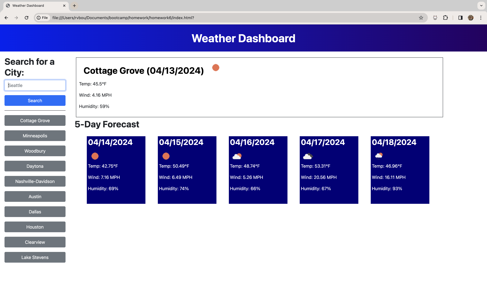

# Weather Dashboard

## Description

This Weather Dashboard application retrieves weather data for cities using third-party APIs. It uses localStorage to store persistent data.

## Authors and acknowledgement

Thank you to AskBCS Learning Assistants for answering my questions about the parameters of the project.

## Screenshot

## Deployed Application

[Click here](https://rvbouu.github.io/weather-dashboard/) to view the deployed version.